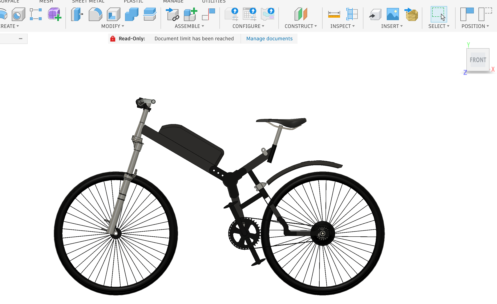
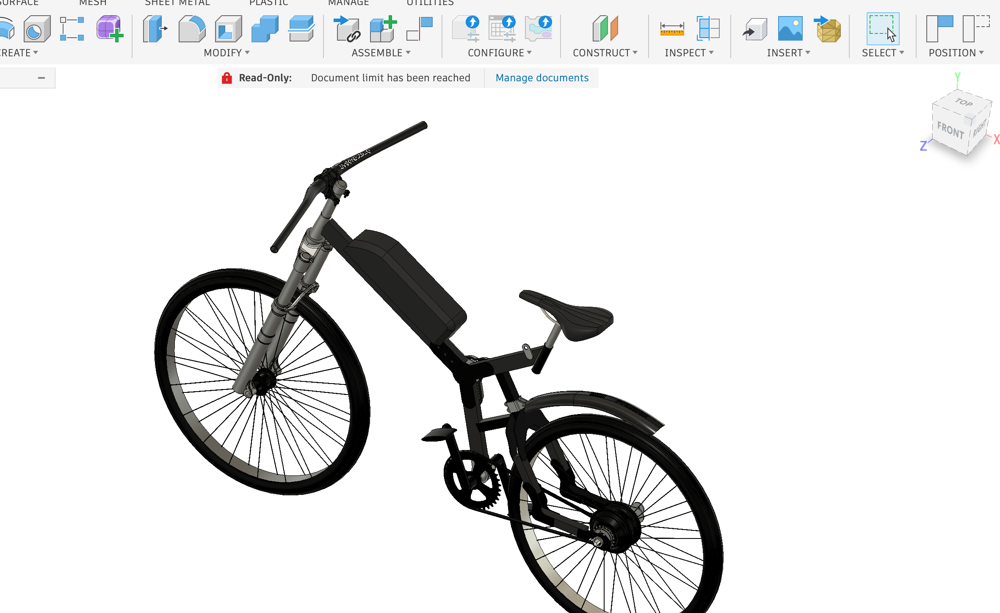
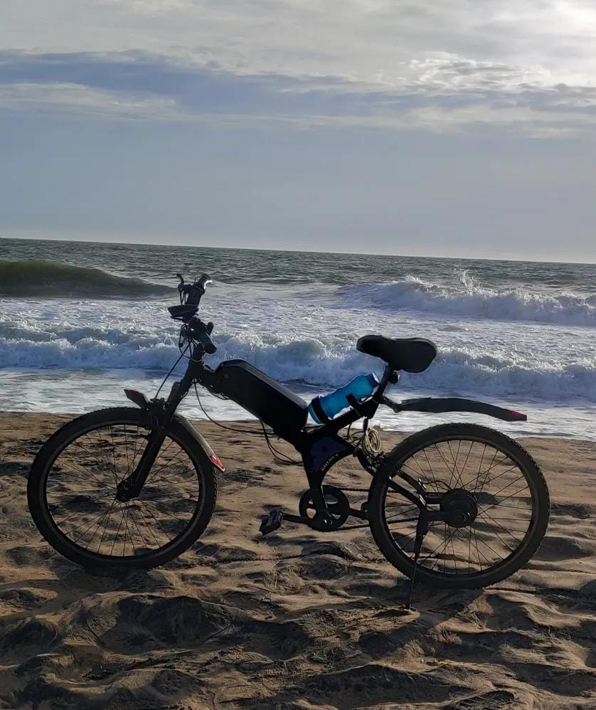

# Electric Bicycle — Design & Fabrication

## Overview

A fully self-designed and fabricated electric bicycle developed
as a personal engineering project.

The project involved the complete mechanical design of the
bicycle, including the structural frame, drivetrain integration,
and fabrication of the final prototype.

## Key Contributions

- Complete CAD design of the bicycle
- Structural frame design
- Drivetrain integration
- Component selection and integration
- Fabrication of the frame
- Assembly and testing of the prototype

## CAD

The repository contains selected CAD models and engineering drawings of the bicycle and its major components.

  

  

## Final Prototype

  
  

## Tools & Technologies

- CAD
- Mechanical Design
- Product Development
- Fabrication
- 3D CAD Modelling

  ## Fabrication Process

  

  <b>▶️ Click the image to watch the complete fabrication process</b>

